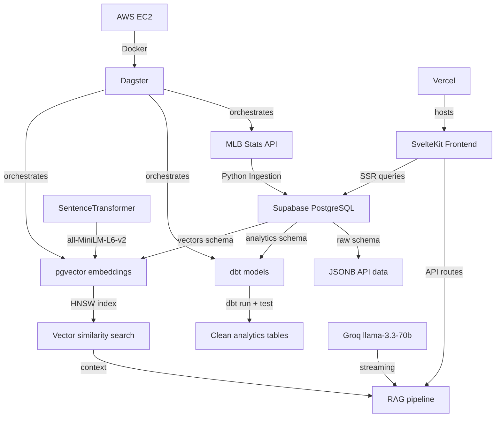
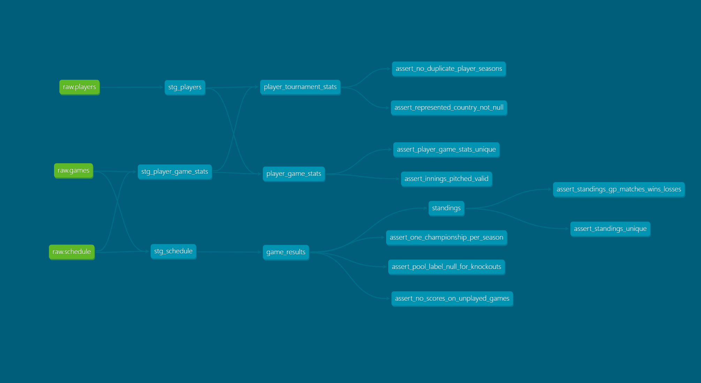

# WBC Dashboard

> Full-stack World Baseball Classic analytics dashboard with AI-powered Q&A

**Live:** [wbc.davidr.io](https://wbc.davidr.io) · **Stack:** SvelteKit · Python ELT · dbt · Dagster · pgvector RAG · Supabase · Docker · AWS EC2

---

## Architecture






---

## Tech Stack

| Layer | Technology | Why |
|---|---|---|
| **Frontend + API** | SvelteKit | Full-stack in one deploy. Simpler than Next.js, Svelte 5 runes syntax. |
| **Database** | Supabase (PostgreSQL) | Free managed Postgres, pgvector built in, row-level security. |
| **Ingestion** | Python | Standard ELT — load raw JSON, transform later with dbt. |
| **Transforms** | dbt | SQL-based transforms with automated testing, documentation, data lineage. |
| **Orchestration** | Dagster | Asset-based pipeline with first-class dbt integration. Chose over Airflow (approaching EOL 2026). |
| **Vector search** | pgvector (HNSW) | Stored inside existing Postgres — no separate vector DB. HNSW index improved similarity scores from ~0.39 to ~0.66 over ivfflat. |
| **Embeddings** | all-MiniLM-L6-v2 | Local SentenceTransformer — 384 dims, free, no API cost or rate limits. Embeds 16K+ rows in ~1 min on CPU. |
| **LLM** | Groq llama-3.3-70b-versatile | Free tier, streaming, fast. |
| **Frontend deploy** | Vercel | Native SvelteKit support, zero config. |
| **Pipeline deploy** | AWS EC2 | Dockerized pipeline, m7i-flex.large (fixed CPU baseline). |
| **CI/CD** | GitHub Actions | dbt tests on every push, auto-deploy to EC2 on pipeline changes. |
| **Styling** | Tailwind v4 | Vite plugin — no config file, auto content detection. |

---

## Features

### Dashboard (`/`)
- Tournament bracket (Championship → Semifinals → Quarterfinals)
- Pool standings grouped by season and pool
- Recent results feed

### Games (`/games`)
- Browse all completed games across 2006–2026 WBC seasons
- Season tabs, round filter pills, stat cards
- Game cards with round badges and scores

### Players (`/players`)
- Season-tabbed leaderboards for batting and pitching
- Stat filters: AVG, HR, RBI, OPS, SB | ERA, K, IP, W, SV
- Clickable player names link to full profiles

### Player Profiles (`/players/[id]`)
- Bio card with flag, position, physical stats, WBC history
- Career totals (multi-season players only)
- Per-season stat table with selected season highlighting
- Game log with pitcher/batter table branching

### AI Chat (`/chat`)
- RAG pipeline: embed question → vector search → LLM answer with streaming
- Pre-embedding question rewriting resolves pronouns and context from conversation history
- Source data: 16K+ embedded sentences across games, standings, player stats, Q&A pairs

---

## Key Architecture Decisions

**ELT over ETL:** Raw data loads directly into PostgreSQL; dbt handles all transforms inside the database. Modern separation of concerns.

**PostgreSQL over Snowflake:** Dataset is ~50K rows. Right tool for the actual data volume — demonstrates OLTP vs OLAP distinction.

**pgvector over Pinecone:** Vector storage consolidated inside existing PostgreSQL instance. No performance justification for a separate vector DB at this scale.

**HNSW over ivfflat:** Similarity scores improved from ~0.39 to ~0.66. HNSW has better recall and no training-data requirement.

**Dagster over Airflow:** Airflow 2 approaching end of life in 2026. Dagster treats pipelines as software-defined assets with first-class data lineage and native dbt integration.

**Local embeddings over API:** Switched from VoyageAI (rate limited, requires API key) to local all-MiniLM-L6-v2 — free, no rate limits, runs on CPU.

**No LangChain:** RAG pipeline uses direct fetch to local embedder + Groq SDK. Eliminates abstraction layer — LangChain added no value.

**RAG over MCP:** Tournament data is fully historical and static. Pre-indexed embeddings give lower latency and simpler architecture than live tool calling.

**SvelteKit over Next.js:** Simpler mental model, better runtime performance. AI layer designed to be extractable into a FastAPI microservice — one HTTP endpoint swap, nothing else changes.

**Question rewriting for RAG:** Before vector search, a lightweight Groq call (`temperature=0`, `max_tokens=128`) rewrites the user's question into a standalone query by resolving pronouns and adding conversation context. The final answer generation receives no conversation history, only the rewritten question + RAG context.

---

## Local Setup

### Prerequisites
- Python 3.11+
- Node.js 18+
- Supabase project with pgvector enabled
- Groq API key (free tier)

### Pipeline

```bash
cd pipeline
python -m venv venv
source venv/bin/activate  # Windows: venv\Scripts\activate
pip install -r requirements.txt

# Configure .env.local at repo root with:
# DB_HOST, DB_USER, DB_PASSWORD, DB_NAME
# SUPABASE_URL, SUPABASE_SERVICE_ROLE_KEY
# GROQ_API_KEY

# 1. Ingest raw data
python ingestion/ingest.py

# 2. Transform with dbt
cd dbt/wbc_dbt
export SUPABASE_HOST=... SUPABASE_USER=... SUPABASE_PASSWORD=... SUPABASE_DB=...
dbt deps
dbt run
dbt test

# 3. Generate embeddings
cd ../..
python ingestion/embed.py
```

### Frontend

```bash
cd frontend
npm install
npm run dev
# → http://localhost:5173
```

### Docker (full pipeline)

```bash
cd pipeline
docker compose up --build -d
# Dagster UI → http://localhost:3000
```

---

## Project Structure

```
wbc-dashboard/
├── pipeline/
│   ├── ingestion/
│   │   ├── ingest.py              # MLB Stats API → Supabase raw tables
│   │   └── embed.py               # Sentence embedding → vectors.embeddings
│   ├── dbt/wbc_dbt/
│   │   ├── models/
│   │   │   ├── staging/           # Views: stg_schedule, stg_players, stg_player_game_stats
│   │   │   └── analytics/         # Tables: game_results, standings, player_game_stats, player_tournament_stats
│   │   ├── macros/
│   │   ├── tests/                 # 9 custom singular tests + generic tests
│   │   └── dbt_project.yml
│   ├── dagster/wbc_dagster/
│   │   ├── assets/                # fetch_mlb_data, run_dbt_transforms, refresh_embeddings
│   │   ├── resources/
│   │   ├── schedules/
│   │   └── definitions.py
│   ├── Dockerfile
│   ├── entrypoint.sh
│   └── docker-compose.yml
├── frontend/
│   ├── src/
│   │   ├── routes/                # /, /games, /players, /players/[id], /chat, /api/chat
│   │   ├── lib/server/
│   │   │   ├── db.ts              # Supabase client (service role, analytics schema)
│   │   │   └── rag.ts             # RAG pipeline: rewrite → embed → retrieve → stream
│   │   └── app.html
│   ├── app.css                    # Tailwind v4 (single @import)
│   └── vite.config.ts
├── .github/workflows/
│   ├── dbt-tests.yml              # dbt run + test on every push
│   └── deploy.yml                 # SSH deploy to EC2 on pipeline/** changes
├── .env.local
└── README.md
```

---

## CI/CD

**dbt tests** run on every push via `.github/workflows/dbt-tests.yml` — runs `dbt deps` → `dbt run` → `dbt test`.

**Frontend** auto-deploys to Vercel on merge to main (adapter-auto, zero config).

**Pipeline** deploys to AWS EC2 via SSH on `pipeline/**` file changes — `git pull` → `docker compose down` → `docker compose up --build -d`.

All secrets managed via GitHub repo secrets: `DB_HOST`, `DB_USER`, `DB_PASSWORD`, `DB_NAME`, `EC2_HOST`, `EC2_USER`, `EC2_SSH_KEY`.

---

## Data Sources

All data from the [MLB Stats API](https://statsapi.mlb.com) (free, no auth required). Covers all WBC seasons (2006–2026): ~251 games, ~605 players, ~14,700 player-game records, ~16,000+ vector embeddings.

---

## License

MIT