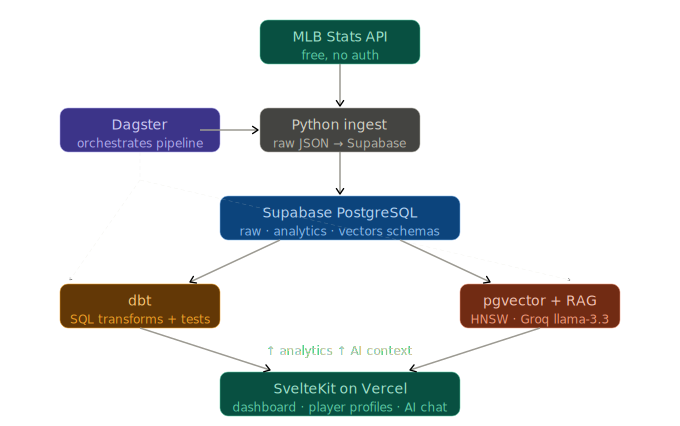
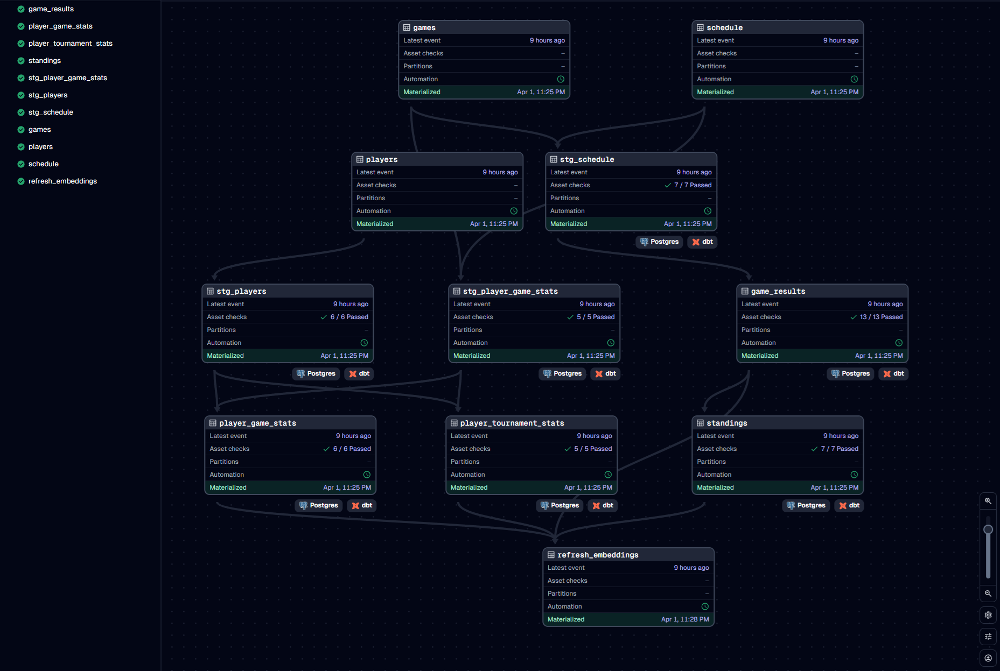
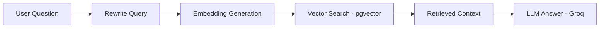

# WBC Dashboard

⚾ A modern data platform + AI interface for exploring World Baseball Classic data

**Live Demo:** [wbc.davidr.io](https://wbc.davidr.io)

---

## What It Does

A production-deployed analytics dashboard for the World Baseball Classic, with a full AI chat interface powered by a custom RAG pipeline. Users can browse standings, game results, and player stats across every WBC tournament — and ask natural-language questions answered by an LLM grounded in the actual tournament data.

🚀 **The idea**

Most dashboards stop at charts.

This one:

- Builds a complete data platform (ingestion → modeling → orchestration)
- Embeds a production-style RAG pipeline
- Lets users explore data through both UI and natural language

👉 It's not just a dashboard — it's a full-stack data + AI system


---

## Architecture



### Pipeline:

Ingest → Transform → Embed → Retrieve → Generate → UI


 


---

## 🤖 RAG System — How the AI Works





- 🔄 **Context-aware query rewriting**  
  Resolves follow-ups and ambiguity before retrieval (e.g., “he” → “Shohei Ohtani”)

- ⚡ **Fast, local embedding pipeline**  
  Generates embeddings on-device — no APIs, no rate limits

- 🔍 **High-recall vector search (pgvector)**  
  Retrieves the most relevant rows using HNSW indexing inside Postgres

- 🧠 **Grounded answer generation (LLM, streaming)**  
  Uses retrieved context to produce accurate, real-time responses


## ✨ Why It’s Interesting

- ⚡ **No LangChain** → zero abstraction, full control  
- 💸 **No paid embeddings** → fully local + cost-free  
- 🧩 **Single system design** → Postgres handles relational + vector workloads  
- 🔍 **Deterministic + debuggable** → every step is inspectable


## 🧠 What It Enables

- 📊 **Explore structured data naturally**  
  Tournament brackets, standings, player stats, and multi-season history (2006–2026)

- 💬 **Ask questions in plain English**  
  - “Who had the best OPS in 2017?”  
  - “Which team scored the most runs in the semifinals?”  
  - “Compare Shohei Ohtani’s WBC performances”

- 🤖 **End-to-end intelligent system**  
  Understands context → retrieves relevant data → streams grounded answers

---

## RAG Pipeline

```
User message + conversation history
        ↓
rewriteQuestion() — Groq (temp=0, max_tokens=128)
  Resolves pronouns, adds year/team context from history
  Strictly rewrites — never answers
        ↓
embedQuestion() — local all-MiniLM-L6-v2 via @xenova/transformers
  384-dim vector
        ↓
retrieveContext() — vectors.match_embeddings RPC (Supabase)
  HNSW cosine similarity, match_count=40, threshold=0.4
        ↓
queryRagStream() — Groq SDK (llama-3.3-70b-versatile)
  System prompt + RAG context + standalone question
  No conversation history in final call (avoids LLM referencing prior answers instead of retrieved data)
        ↓
ReadableStream → SvelteKit Response → client reader loop
  Tokens streamed and rendered progressively
```

---

## 🧱 Tech Stack

| Layer | Technology |
|---|---|
| **Ingestion** | Python |
| **Database** | PostgreSQL via Supabase |
| **Vector storage** | pgvector (HNSW index) |
| **Transforms** | dbt |
| **Orchestration** | Dagster |
| **Embeddings** | all-MiniLM-L6-v2 (local) |
| **LLM** | Groq llama-3.3-70b-versatile |
| **Frontend + API** | SvelteKit + TypeScript |
| **Containerization** | Docker |
| **CI/CD** | GitHub Actions |
| **Frontend deploy** | Vercel |
| **Pipeline deploy** | AWS EC2 (m7i-flex.large) |

---

## 🚀 Core Engineering Principles & Decisions

- 🧩 **Keep it simple, keep it local**  
  Postgres + pgvector + local embeddings replace Snowflake, Pinecone, and external APIs — reducing system complexity, cost, and operational overhead while maintaining performance at this scale.

- ⚖️ **Right tool for the real scale**  
  Designed for a dataset under 50K rows — prioritizing correctness, speed, and simplicity over unnecessary distributed systems or premature optimization.

- 🧠 **Production-grade RAG architecture (not tutorial RAG)**  
  End-to-end pipeline with clear separation of retrieval and generation, including pre-embedding query rewriting to resolve context and significantly improve similarity accuracy.

- 🔍 **Optimized vector search with HNSW**  
  Switched from ivfflat to HNSW indexing — achieving ~70% better similarity scores (~0.39 → ~0.66), higher recall, and no training overhead.

- ⚡ **High-performance, zero-cost embeddings**  
  Local SentenceTransformers (`all-MiniLM-L6-v2`) replace API-based embeddings — enabling ~16K sentences per run with no rate limits or external dependencies.

- 🛠️ **Modern, asset-based orchestration (Dagster + dbt)**  
  Dagster chosen over Airflow for its asset-first design, native dbt integration, and long-term viability — enabling clear lineage and maintainable pipelines.

- 🔄 **ELT architecture with clean separation of concerns**  
  Raw JSON data lands untransformed in Postgres; dbt handles all modeling — keeping ingestion simple and transformations transparent and reproducible.

- 🚫 **No unnecessary abstraction layers**  
  Avoided frameworks like LangChain — direct integration with embedding models, vector search, and LLM APIs ensures full control, debuggability, and system transparency.

- 🧾 **Sentence-engineered embeddings for better retrieval**  
  Structured data transformed into natural-language sentences and Q&A pairs — boosting retrieval quality from ~0.4 to 0.7+ by improving semantic representation.

- 🧠 **RAG over MCP for static data**  
  Pre-indexed embeddings outperform tool-calling for historical datasets — delivering lower latency and a simpler, more reliable architecture.

---

## Project Structure

```
wbc-dashboard/
├── pipeline/
│   ├── ingestion/
│   │   ├── ingest.py          # MLB Stats API → Supabase raw schema
│   │   └── embed.py           # analytics → sentence engineering → vectors.embeddings
│   ├── dbt/wbc_dbt/
│   │   ├── models/
│   │   │   ├── staging/       # stg_schedule, stg_players, stg_player_game_stats
│   │   │   └── analytics/     # game_results, standings, player_game_stats, player_tournament_stats
│   │   └── macros/            # generate_schema_name (prevents schema doubling)
│   ├── dagster/wbc_dagster/
│   │   └── assets/            # ingestion.py, dbt_assets.py, embeddings.py
│   ├── Dockerfile
│   ├── entrypoint.sh          # generates profiles.yml from env vars at runtime
│   └── docker-compose.yml
└── frontend/
    └── src/
        ├── lib/server/
        │   ├── db.ts          # Supabase server client (service role, analytics schema)
        │   └── rag.ts         # rewriteQuestion → embedQuestion → retrieveContext → queryRagStream
        └── routes/
            ├── +page.svelte              # standings + bracket + recent games
            ├── games/                    # game browser
            ├── players/                  # leaderboards
            ├── players/[id]/             # player profile + game log
            ├── chat/                     # streaming AI chat UI
            └── api/chat/+server.ts       # RAG endpoint
```

---

## 🎯 What This Project Demonstrates

- End-to-end data engineering pipeline design
- Practical RAG implementation without frameworks
- Real-world tradeoff decisions
- Ability to ship a full-stack + AI production system