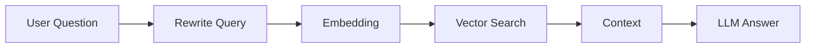
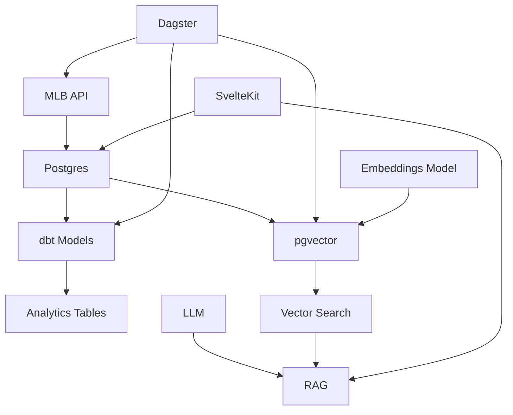

# ⚾ WBC Dashboard

```{=html}
<p align="center">
```
`<b>`{=html}A full-stack data platform + AI interface for the World
Baseball Classic`</b>`{=html}`<br/>`{=html} `<i>`{=html}Explore baseball
data visually --- or just ask it questions`</i>`{=html}
```{=html}
</p>
```
```{=html}
<p align="center">
```
`<a href="https://wbc.davidr.io">`{=html}`<b>`{=html}🌐 Live
Demo`</b>`{=html}`</a>`{=html} • `<a href="#">`{=html}`<b>`{=html}📦
GitHub`</b>`{=html}`</a>`{=html}
```{=html}
</p>
```

------------------------------------------------------------------------

```{=html}
<p align="center">
```
``{=html}
``{=html}
``{=html}
``{=html}
``{=html}
```{=html}
</p>
```

------------------------------------------------------------------------

## 🚀 The idea

Most data projects stop here:

> "Here's a dashboard."

This one goes further:

-   📊 **Interactive analytics UI**
-   🧠 **AI that answers questions about your data**
-   ⚙️ **Production-style data pipeline**

👉 It's a **data platform**, not just a frontend.

------------------------------------------------------------------------

## ⚡ Demo

### 📊 Dashboard

```{=html}
<p align="center">
```
``{=html}
```{=html}
</p>
```
### 💬 AI Chat (RAG)

```{=html}
<p align="center">
```
``{=html}
```{=html}
</p>
```

------------------------------------------------------------------------

## 🧠 How the AI works



------------------------------------------------------------------------

## 🏗️ Architecture



------------------------------------------------------------------------

## 🧱 Stack

-   SvelteKit\
-   PostgreSQL (Supabase)\
-   dbt\
-   Dagster\
-   pgvector\
-   all-MiniLM-L6-v2\
-   Groq (Llama 3)\
-   Docker + AWS EC2

------------------------------------------------------------------------

## 📄 License

MIT
